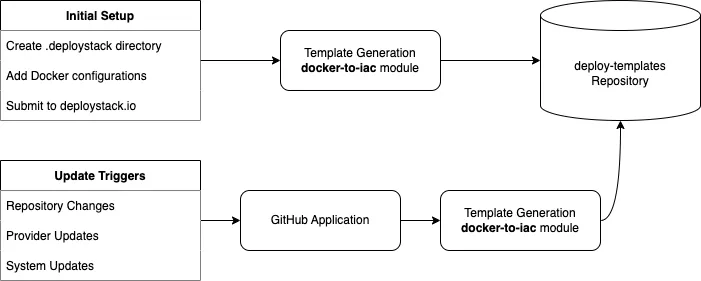
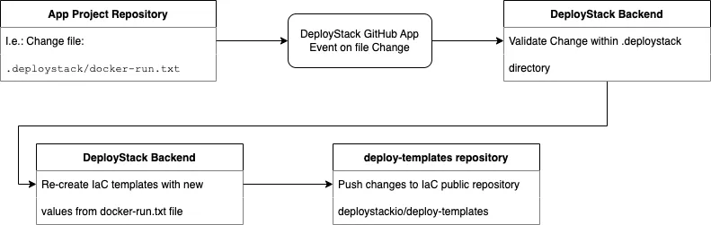

# Infrastructure as Code Lifecycle

This guide explains how DeployStack manages and updates your Infrastructure as Code (IaC) templates throughout their lifecycle.

## Template Generation Process

### Initial Setup

1. Create a `.deploystack` [configuration directory](/docker-deployment/deploystack-configuration-directory) in your repository
2. Add your Docker configuration files:
   - `docker-compose.yml` for Compose configurations
   - `docker-run.txt` for Docker run commands
3. Submit your repository to [deploystack.io/submit](https://deploystack.io/submit)
4. Initial IaC templates are generated and stored in our [deploy-templates](https://github.com/deploystackio/deploy-templates) repository

### Enabling Automatic Updates

Install the [DeployStack Repository Sync](/docker-deployment/github-application) GitHub App to keep your templates up to date when:

- You modify Docker configurations in the `.deploystack` directory
- Cloud providers update their IaC specifications
- DeployStack improves its template generation

## Update Flow

As the app GitHub repository owner, an update flow gives you control over the generation of Infrastructure as Code (IaC) templates. The flow allows you to regenerate IaC templates by changing, for example, the `.deploystack/docker-compose.yml` file.

All IaC templates are stored in public and open-source repository: [https://github.com/deploystackio/deploy-templates](https://github.com/deploystackio/deploy-templates).

### Prerequisites for activating the flow

1. You have installed the [DeployStack GitHub app](/docker-deployment/github-application).
2. You have created the `.deploystack/docker-run.txt` or `.deploystack/docker-compose.yml` file.

The choice between `docker-run.txt` or `docker-compose.yml` depends on the submission process used to DeployStack. When submitting to DeployStack, you can choose two methods -> Docker Run or Docker Compose.

### Example flow

Let's say you want to change your image tag from "deploystack/awesomeapp:v1" to "deploystack/awesomeapp:v2-next".

1. To do this, you will edit the file `.deploy stack/docker-run.txt` and change your new docker tag
2. GitHub will send an event to the DeployStack backend with the change of the file `.deploy stack/docker-run.txt` because you have the DeployStack GitHub app installed.
3. DeployStack backend validates the change, and if everything test passes
4. By using [docker-to-iac module](https://github.com/deploystackio/docker-to-iac), DeployStack backend will generate the new IaC templates for your application and store them in our repository [https://github.com/deploystackio/deploy-templates](https://github.com/deploystackio/deploy-templates)

## Update Triggers

Your IaC templates are automatically updated in these scenarios:

### Repository Changes

When you modify files in your repository's default branch:

- Changes to `docker-compose.yml` or `docker-run.txt` in `.deploystack` directory
- Updates to repository metadata

### Provider Updates

Templates are regenerated when:

- Cloud providers modify their IaC specifications
- New provider features become available
- Provider API requirements change

### System Updates

DeployStack initiates template updates when:

- The docker-to-iac module receives improvements
- New template optimizations are available
- Bug fixes are released

## Template Versioning

All template updates are version controlled in our [deploy-templates repository](https://github.com/deploystackio/deploy-templates), allowing you to:

- Track template changes over time
- Review modification history
- Understand update triggers
