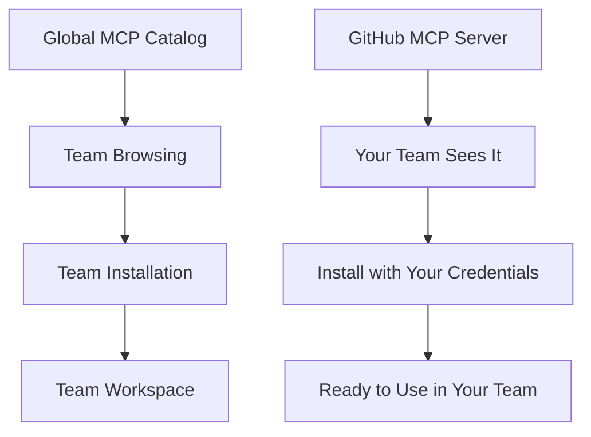

# MCP Server Installation

MCP server installations are how your team actually uses MCP servers from the catalog. Think of the MCP catalog as a "store" where you browse available servers, and installations as the "purchased items" that your team can actually use with your own credentials and settings.

## Understanding the Connection

### The Three-Layer System

DeployStack uses a three-layer system to manage MCP servers:

1. **Global MCP Catalog**: A centralized library of all available MCP servers
2. **Team Access**: Your team can browse and select servers you have permission to use
3. **Team Installations**: Your team's actual configured instances of MCP servers

### How It Works

## MCP Server Installation Scope

### Team-Centered Installations

**Every MCP server installation belongs to a specific team.** This is a fundamental principle of DeployStack:

- **Team Ownership**: Each installation is owned by one team and isolated from other teams
- **Team Credentials**: Your team provides and manages its own API keys, tokens, and configuration
- **Team Configuration**: Customize server settings specific to your team's needs
- **Team Privacy**: Other teams cannot see or access your installations

### Why Team-Scoped?

This design provides several important benefits:

#### Security Isolation
- **Credential Separation**: Your team's API keys are completely separate from other teams
- **Access Control**: Only your team members can use your team's installations
- **Data Privacy**: No cross-team access to configurations or usage data

#### Flexibility
- **Custom Names**: Give installations meaningful names for your team context
- **Team-Specific Settings**: Configure servers differently for your team's workflow
- **Independent Updates**: Update or modify installations without affecting other teams

#### Organization
- **Clear Ownership**: Every installation has a clear team owner
- **Team Management**: Team administrators control all installations
- **Workspace Isolation**: Each team has its own complete workspace

## Team Workspace Context

### How Installations Fit in Your Team

Your team's MCP server installations are part of your complete team workspace:

#### Team Resources
- **MCP Installations**: Configured MCP servers ready to use
- **Cloud Credentials**: Authentication for deployment platforms
- **Environment Variables**: Global team settings
- **Team Members**: Users who can access these resources

#### Workspace Benefits
- **Unified Management**: All team resources in one place
- **Consistent Access**: Same permissions across all installations
- **Shared Configuration**: Common settings available to all installations
- **Team Collaboration**: All team members work with the same tools

### Database Storage

Behind the scenes, your team's installations are stored securely:

#### Team-Level Storage
- **Team Workspace**: All installations belong to your team's workspace
- **Encrypted Credentials**: Your API keys and tokens are encrypted at rest
- **Access Control**: Only your team members can access the data
- **Audit Trail**: Complete history of installation changes

#### Data Isolation
- **Team Boundaries**: Your data is completely separate from other teams
- **Secure Access**: Only authorized team members can view or modify installations
- **Privacy Protection**: No cross-team data sharing or access

## Installation Types

### Local Installations

**Local MCP servers** run on your team's infrastructure:

- **Your Environment**: Runs in your team's deployment environment
- **Direct Control**: Full control over the server instance
- **Custom Configuration**: Unlimited customization options
- **Team Credentials**: Uses your team's API keys and authentication

### Cloud Installations (Future)

**Cloud MCP servers** will run on managed infrastructure:

- **Managed Service**: DeployStack handles the infrastructure
- **Simplified Setup**: Easier installation and maintenance
- **Automatic Updates**: Managed updates and scaling
- **Team Isolation**: Still team-scoped with your credentials

## Security Considerations

### Credential Protection

Your team's installation credentials are protected through multiple layers:

- **Encryption at Rest**: All credentials are encrypted in the database
- **Access Control**: Only team members can access credentials
- **Secure Transmission**: Credentials are encrypted during transmission
- **Audit Logging**: All credential access is logged for security

### Team Boundaries

The team-scoped installation system provides strong security boundaries:

- **Complete Isolation**: Teams cannot access each other's installations
- **Separate Credentials**: Each team uses completely separate authentication
- **Independent Configuration**: No shared configuration between teams
- **Secure Defaults**: Installations use secure default settings

MCP server installations provide the bridge between the global catalog of available servers and your team's actual working environment. By understanding how installations work within your team workspace, you can effectively manage your team's MCP server landscape while maintaining security and organization.
