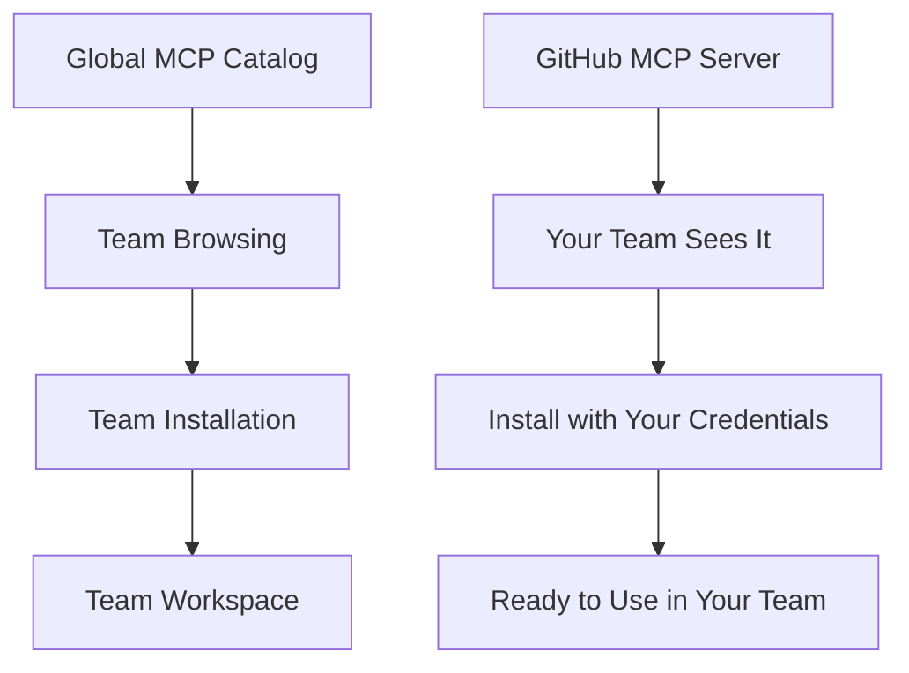

# MCP Server Installation

MCP server installations are how your team actually uses MCP servers from the catalog. Think of the MCP catalog as a "store" where you browse available servers, and installations as the "purchased items" that your team can actually use with your own configurations.

Installations represent the team layer in DeployStack's three-tier configuration system, where teams configure shared settings that all team members use. For complete details about how arguments, environment variables, and credentials work, see the [MCP Configuration System](/mcp-configuration) documentation.

## Understanding the Connection

### The Three-Layer System

DeployStack uses a three-layer system to manage MCP servers:

1. **Global MCP Catalog**: A centralized library of all available MCP servers (including both official registry servers synced from registry.modelcontextprotocol.io and manually created custom integrations)
2. **Team Access**: Your team can browse and select servers you have permission to use
3. **Team Installations**: Your team's actual configured instances of MCP servers

### How It Works

## MCP Server Installation Scope

### Team-Centered Installations

**Every MCP server installation belongs to a specific team.** This is a fundamental principle of DeployStack:

- **Team Ownership**: Each installation is owned by one team and isolated from other teams
- **Team Configuration**: Teams manage the shared configuration layer that all team members inherit
- **Team Privacy**: Other teams cannot see or access your installations

For detailed information about how team configurations work within the three-tier system, see [MCP Configuration System](/mcp-configuration).

### Why Team-Scoped?

This design provides several important benefits:

#### Security Isolation
- **Configuration Separation**: Your team's settings and credentials are completely separate from other teams
- **Access Control**: Only your team members can use your team's installations
- **Data Privacy**: No cross-team access to configurations or usage data

#### Flexibility
- **Custom Names**: Give installations meaningful names for your team context
- **Team-Specific Settings**: Configure shared team settings while allowing individual member customization
- **Independent Updates**: Update or modify installations without affecting other teams

#### Organization
- **Clear Ownership**: Every installation has a clear team owner
- **Team Management**: Team administrators control all installations
- **Workspace Isolation**: Each team has its own complete workspace

## Team Workspace Context

### How Installations Fit in Your Team

Your team's MCP server installations are part of your complete team workspace:

#### Team Resources
- **MCP Installations**: Configured MCP servers ready to use
- **Shared Configuration**: Team-level settings that all members inherit
- **Team Members**: Users who can access these resources and create personal configurations

#### Workspace Benefits
- **Unified Management**: All team resources in one place
- **Consistent Access**: Same permissions across all installations
- **Configuration Hierarchy**: Team settings combined with personal user settings
- **Team Collaboration**: All team members work with shared team configurations

### Database Storage

Behind the scenes, your team's installations are stored securely:

#### Team-Level Storage
- **Team Workspace**: All installations belong to your team's workspace
- **Secure Configuration**: Team settings and credentials are encrypted at rest
- **Access Control**: Only your team members can access the data
- **Audit Trail**: Complete history of installation changes

#### Data Isolation
- **Team Boundaries**: Your data is completely separate from other teams
- **Secure Access**: Only authorized team members can view or modify installations
- **Privacy Protection**: No cross-team data sharing or access

## Installation Types

### Local Installations

**Local MCP servers** run on your team's infrastructure:

- **Your Environment**: Runs in your team's deployment environment
- **Direct Control**: Full control over the server instance
- **Multiple Sources**: Install servers from the official MCP Registry or use custom manually-created servers
- **Flexible Configuration**: Team-level and user-level configuration options
- **Secure Setup**: Uses DeployStack's three-tier configuration system

### Cloud Installations (Future)

**Cloud MCP servers** will run on managed infrastructure:

- **Managed Service**: DeployStack handles the infrastructure
- **Simplified Setup**: Easier installation and maintenance
- **Automatic Updates**: Managed updates and scaling
- **Team Isolation**: Still team-scoped with the same configuration hierarchy

## Security Considerations

### Configuration Security

Your team's installation configurations are protected through multiple layers:

- **Encryption at Rest**: All team configurations and credentials are encrypted in the database
- **Access Control**: Only team members can access team configurations
- **Secure Transmission**: All configuration data is encrypted during transmission
- **Audit Logging**: All configuration access is logged for security

### Team Boundaries

The team-scoped installation system provides strong security boundaries:

- **Complete Isolation**: Teams cannot access each other's installations
- **Separate Configuration**: Each team uses completely separate settings and credentials
- **Independent Setup**: No shared configuration between teams
- **Secure Defaults**: Installations use secure default settings

For comprehensive details about DeployStack's security model for configurations, see [MCP Configuration System](/mcp-configuration).

MCP server installations provide the bridge between the global catalog of available servers and your team's actual working environment. They represent the team layer in DeployStack's three-tier configuration system, managing shared settings that all team members inherit while allowing individual customization.

For complete understanding of how installations fit into the broader configuration architecture, see the [MCP Configuration System](/mcp-configuration) documentation.
